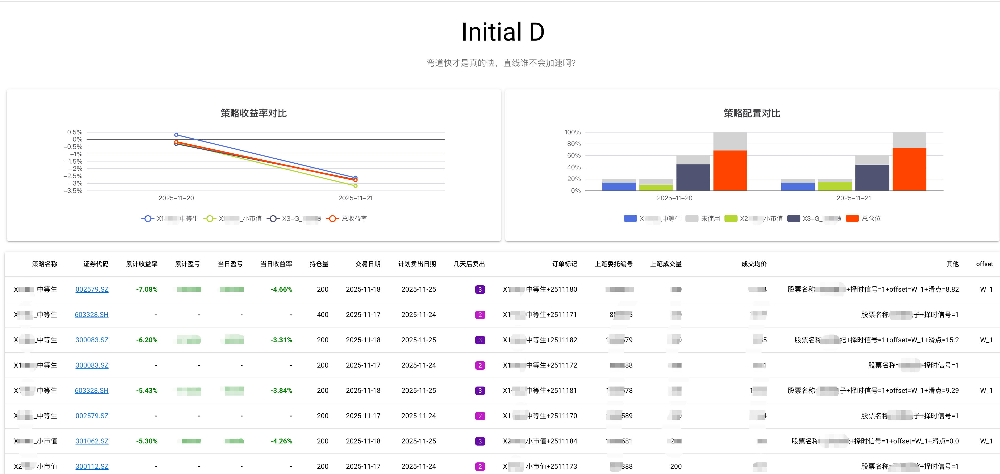

# 秋名山分析系统

> 弯道快才是真的快，直线谁不会加速啊？



使用需要改一点点rocket的代码

修改 exchange_api.py 里面的 simple_statistics，搜索`json_path = self.hold_path.with_name("策略表现.json")`在上下文附近按照下面代码进行修改

```python
data_dict = {
    "data": json.loads(h_tmp.to_json(orient="records")),
    "update_time": int(datetime.now().timestamp()),
}
json_path = self.hold_path.with_name("个股表现.json")

single_stock_performances = []
single_stock_performance_path = (
    boot.app.root_path / "data" / "个股表现_历史.json"
)

if single_stock_performance_path.exists():
    with open(single_stock_performance_path, "r", encoding="utf-8") as f:
        single_stock_performances = json.load(f)

single_stock_performances.append(data_dict)

with open(json_path, "w", encoding="utf-8") as f:
    json.dump(data_dict, f, ensure_ascii=False, indent=2)

with open(single_stock_performance_path, "w", encoding="utf-8") as f:
    json.dump(single_stock_performances, f, ensure_ascii=False, indent=2)

data_dict = {
    "data": json.loads(stg_df.to_json(orient="records")),
    "update_time": int(datetime.now().timestamp()),
}
json_path = self.hold_path.with_name("策略表现.json")

strategy_performances = []
strategy_performance_path = (
    boot.app.root_path / "data" / "策略表现_历史.json"
)

if strategy_performance_path.exists():
    with open(strategy_performance_path, "r", encoding="utf-8") as f:
        strategy_performances = json.load(f)

strategy_performances.append(data_dict)

with open(json_path, "w", encoding="utf-8") as f:
    json.dump(data_dict, f, ensure_ascii=False, indent=2)

with open(strategy_performance_path, "w", encoding="utf-8") as f:
    json.dump(strategy_performances, f, ensure_ascii=False, indent=2)
```

打开 `runtime/config.yml.j2` 修改路径成你要的rocket路径

然后 `uv run main.py`